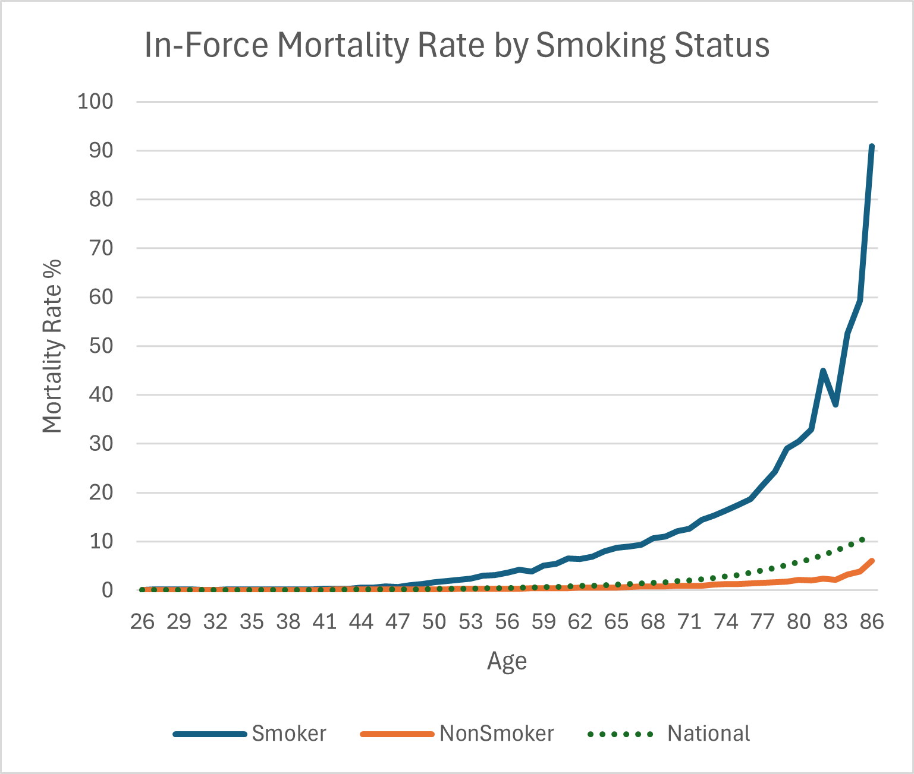
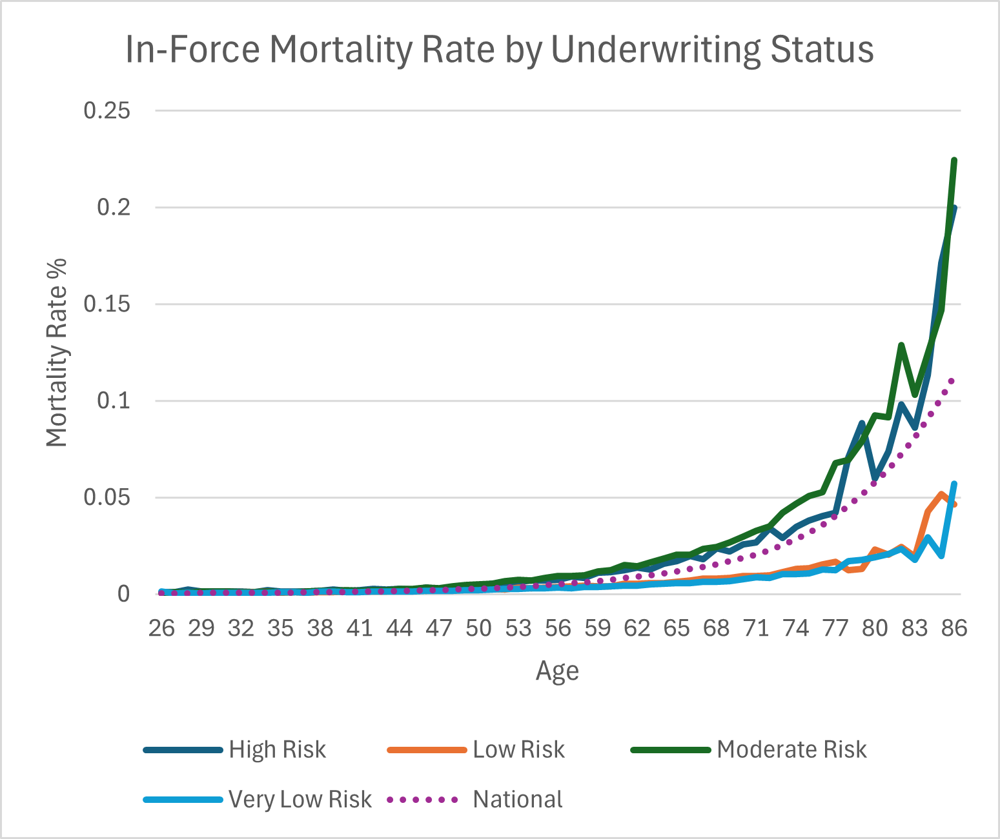
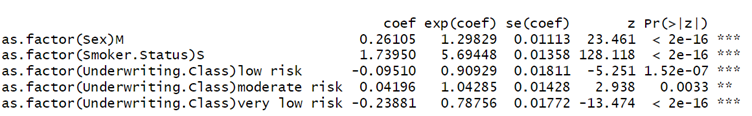
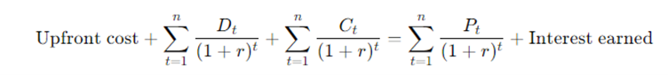
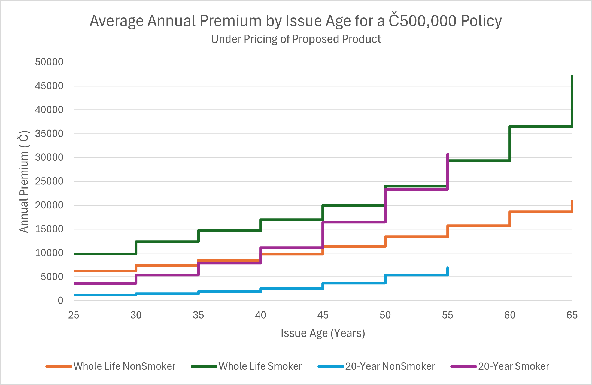
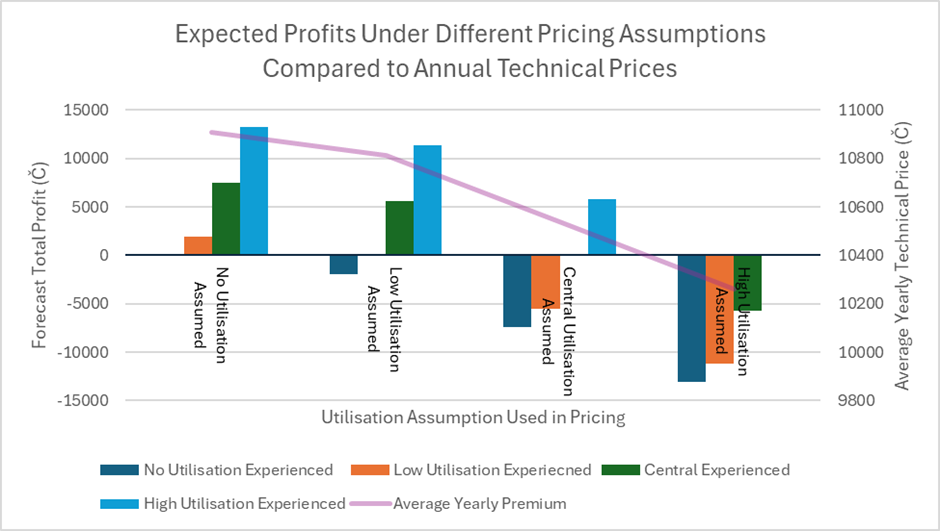

# Actuarial Theory and Practice A @ UNSW

_"No sir, no sir, no sir
New Maybach, but I ain't got a chauffeur" - Chief Keef_

---

### Congrats on completing the [2024 SOA Research Challenge](https://www.soa.org/research/opportunities/2024-student-research-case-study-challenge/)!

>Now it's time to build your own website to showcase your work.  
>To create a website on GitHub Pages to showcase your work is very easy.

This is written in markdown language. 
>
* Click [link](https://classroom.github.com/a/biNKOeX_) to accept your group assignment.

#### Follow the [guide doc](doc1.pdf) to submit your work. 

When you finish the task, please paste your link to the Excel [sheet](https://unsw-my.sharepoint.com/:x:/g/personal/z5096423_ad_unsw_edu_au/ETIxmQ6pESRHoHPt-PUleR4BuN0_ghByf7TsfSfgDaBhVg?rtime=GAd2OFNM3Eg) for Peer Feedback
---
>Be creative! Feel free to link to embed your [data](2024-srcsc-superlife-inforce-dataset-part1.csv), [code](sample-data-clean.ipynb), [image](unsw.png) here

More information on GitHub Pages can be found [here](https://pages.github.com/)

---

### Program Objective

Our program is dedicated to promoting outdoor activities to enhance the well-being of SuperLife’s policyholders, whilst ensuring the sustained growth for the firm. We aimed for the following objectives:
Incentivise healthy behaviours
Decrease expected mortality rates
Improve life insurance sales
Improve marketability and competitiveness
Add economic value to Superlife

---

### Program Design

Three interventions were selected in our program design, addressing specific aspects of out-door activities through the creation of fitness communities, sun safety awareness, and technological integration to maximise efficiency, engagement and effectiveness.

---

Proposed Program

>
* Hiking and outdoor activity groups:
>Leverages the abundant natural landscape of Lumaria, creating a platform for policyholders to immerse in nature and engage in physical activities that promote fitness and well-being

* Sun safety awareness:
>Compliments outdoor activity groups through recognising the importance of mitigating sun-related risks and including a comprehensive sun safety awareness campaign to educate and equip policyholders with the knowledge and tools to protect themselves outside.

>
* Well-being application:
>Creating a centralised well-being application with in-built awareness programs on sun safety, general well-being and hiking and outdoor opportunities.

---

Program Evaluation

We have created short term and long term program evaluation plans to monitor the effectiveness and impact of our program interventions.
>
Short Term
>Conduct annual reviews to track the number of participants engaging in hiking and outdoor activities.
>
Long Term
>Conduct 5-yearly reviews to analyse correlations between reduction in mortality and participation rates in outdoor activity groups.

---

### Pricing Methodology

* Significant disparities in historical mortality rates from the inforce dataset were found between smoking status and underwriting class

* ARIMA models were used to model inflation and interest rates
* A Cox Proportional Hazard model was used to capture relativities in modelling mortality rates

* Pricing was done according to the zero NPV principle

### Pricing Results

* The proposed product is priced according to policy type, age group, smoking status and underwriting class. When offered at the same price, SuperLife would expect to earn on average Č243.94 more from the proposed product than current offerings.
* Life expectancy is expected to improve; an individual aged 30 may also see an increase in life expectancy of up to 1.5 years.

* Average incurred loss per policy on the central estimate of assumptions is expected to be Č3.65 before the addition of any profit margins.
* Sensitivity tests were conducted on prices assuming different levels of utilisation. All tested prices failed under extreme scenarios of low investment returns. The product may still perform well under high inflation if investment returns are healthy, due to the assumption that indexation is limited to 5%p.a. However, high inflation coupled with low returns sees the product incur the greatest total losses.

### Assumptions

* Rates of investment return and inflation: Modelled from historical one- and ten-year spot rates and historical inflation rates using ARIMA modelling, with 95% CI intervals capped at the min and max historical values to model high and low-rate scenarios
* Indexation: The face value lump sum of the amount insured is indexed to inflation at a maximum of 5% per year.
* Expenses: Claims expense of Č5000 is assumed per policyholder. Intervention costs of Č155, derived from the upper-bound total costs for all incentives implemented.
* Death and mortality rate: The mortality rates are modelled according to discrete ages, assumed to be constant between ages.
* Key Assumptions to Costs: While costs of interventions may vary, the assumption is to take the upper limit of combined costs as a conservative measure. Unforeseen increases in recurring costs, translate to lower profit margins and even possible incurred losses. As demonstrated in sensitivity testing, scenarios in which rates of return differ to those expected will cause profitability to vary greatly.
* Lapse Rate: Historical Lapse rates by age group, policy type and gender were used.
* Interventions on mortality: Interventions are assumed to have an additive reduction in mortality rates, with levels of utilisation corresponding to different reductions in mortality. No utilisation leads to no reduction in mortality. A low level of utilisation corresponds to a 2.0 % reduction in mortality, while a high level of utilisation corresponds to a 13.4% reduction in the mortality rate. The central estimate is the average of the two limits, at a 7.7% reduction.

